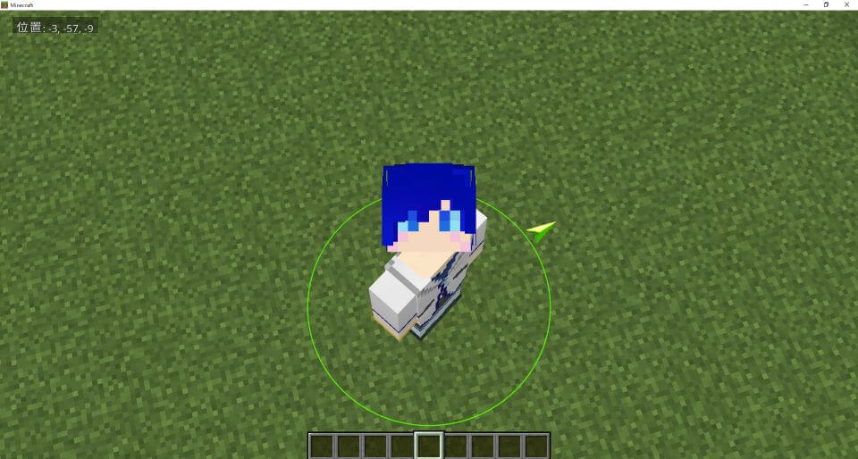
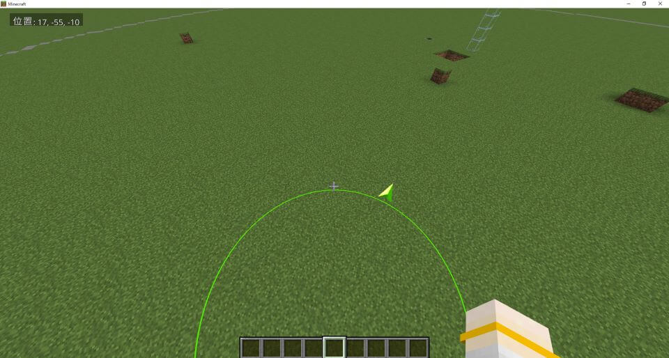

# ParticlePointer
Minecraft Bedrock Resource and Behavior.  
Attach particles to the player and manipulate the particles using the player's data.  
   

# Abstract
The player implements particles with properties and variables, and passes data from the properties to the particles through "pre_effect_script".

# Manipulate the implementation properties.
```
/scriptevent ra:pos <position:x> <position:z>
```
# Problem  
This implementation crashes when the settings screen is opened. I suspect the skin doll is the problem, and there's an issue with the implementation itself.  
Hiding the skin doll will work around this, but I'd appreciate any ideas on how to implement this more elegantly.
